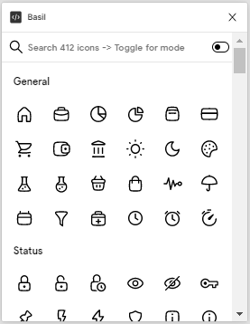

# Basil Icons Plugin

Basil icons plugin provides a collection of simply beautiful open source icons from [Craftwork](https://craftwork.desisgn), with inspiration from [Feather Icons](https://feathericons.com).



Over 500 Outline and Solid icons grouped in 9 of the most used categories to help you in search of what you need. Also includes some icons sourced from my favourite libraries.

<!-- ## Install the [Basil Icons Plugin](https://www.figma.com/c/plugin/744047966581015514/Feather) in Figma. -->

See the complete list of icons at [Craftwork](https://craftwork.design/downloads/basil).

## Local development

1. Clone the repository

   ```shell
   git clone https://github.com/thierryntoh24/basil-plugin.git
   cd basil-plugin
   ```

2. Install the dependencies

   ```c
   npm install
   ```

3. Build the plugin

   ```
   npm build
   ```

4. Open the [Figma desktop app](https://www.figma.com/downloads/)

5. Go to `Menu > Plugins > Development > New Plugin...`

6. Choose `basil-plugin/manifest.json`

7. Run the plugin by going to `Menu > Plugins > Development > Basil Icons`
