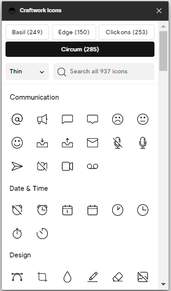

# Craftwork Icons Plugin

Craftwork icons plugin provides a free and growing collection of the cuttiest open source icons from [Craftwork](https://craftwork.desisgn).



Over 650 and growing icons in 3 packs and various commonly used categories to help you in search of what you need.

### Install the [Craftwork Icons Plugin](https://www.figma.com/community/plugin/1047665302404244638) in Figma.

See the complete list of icons at [Icons by Craftwork](https://icons.craftwork.design).

## Local development

1. Clone the repository

   ```shell
   git clone https://github.com/thierryntoh24/craftwork-plugin.git
   cd craftwork-plugin
   ```

2. Install the dependencies

   ```c
   npm install
   ```

3. Build the plugin

   ```
   npm run build
   ```

4. Open the [Figma desktop app](https://www.figma.com/downloads/)

5. Go to `Menu > Plugins > Development > New Plugin...`

6. Choose `craftwork-plugin/manifest.json`

7. Run the plugin by going to `Menu > Plugins > Development > Craftwork Icons`
